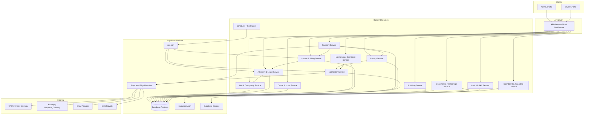
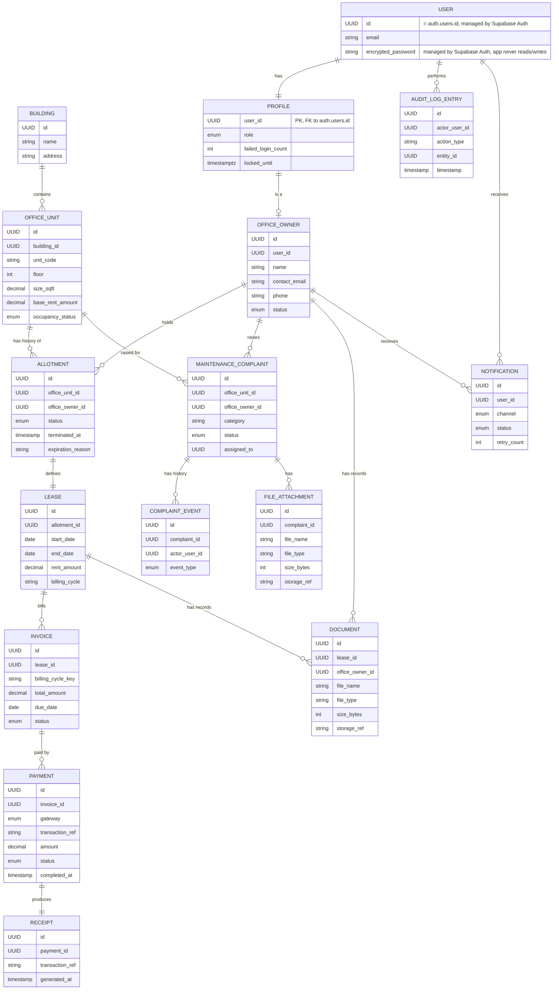
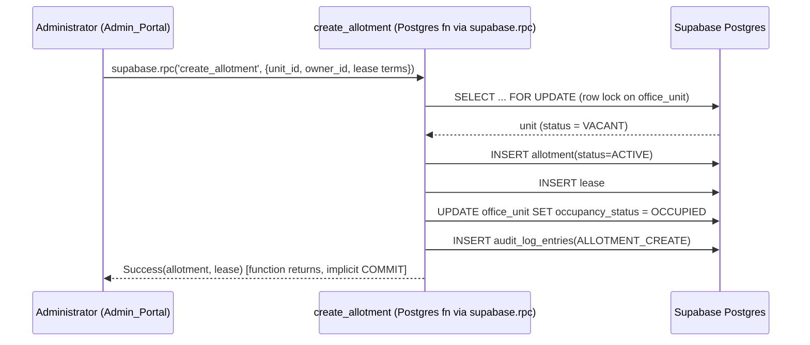
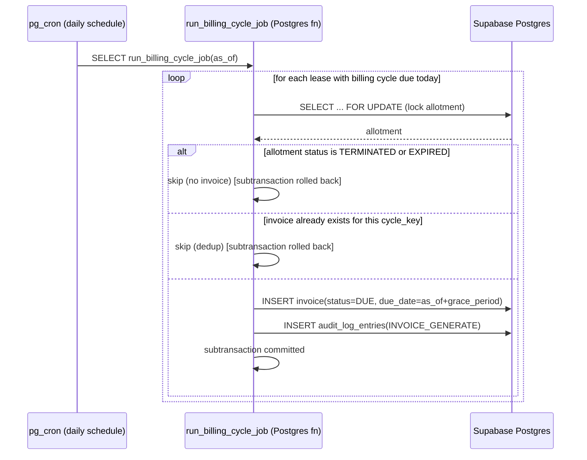
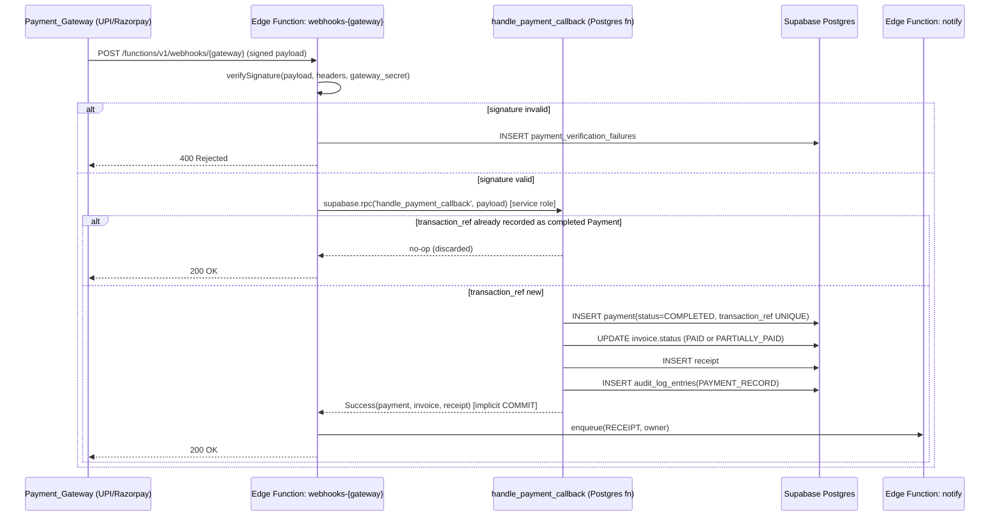
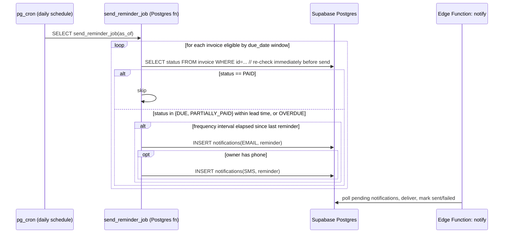
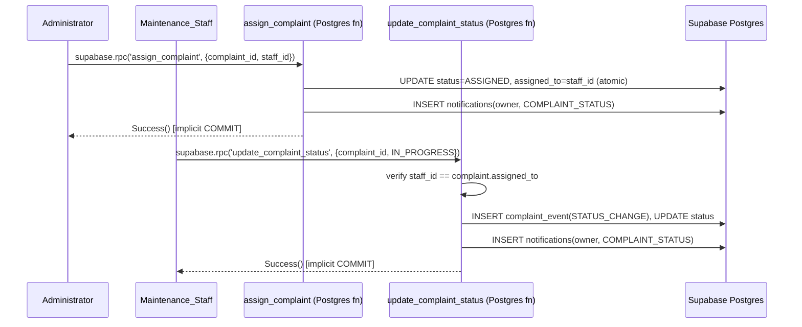

# Design Document: Office Rental CRM

## Overview

The Office Rental CRM is a multi-portal platform that lets an office rental company manage its building/unit inventory, allot units to Office_Owners under leases, bill and collect rent online (UPI and Razorpay), track maintenance complaints, and keep an auditable record of everything that happens to allotments, billing, and accounts.

The system is split into two front-end portals backed by a shared set of backend services:

- **Admin_Portal**: used by Company_Staff (Administrator, Maintenance_Staff) to manage inventory, allotments, owners, billing, complaints, reports, and system configuration.
- **Owner_Portal**: used by Office_Owners to view their own allotments/leases, pay invoices, download receipts/documents, and raise maintenance complaints.

Both portals talk to the same backend over HTTPS, built on **Supabase** as the primary platform:

- **Supabase Postgres** is the single relational database backing every service (for transactional integrity across Allotment/Occupancy/Invoice/Payment/Audit writes), accessed via the Supabase client SDK from the portals and via `supabase-js`/service-role connections from server-side code.
- **Supabase Auth** issues and validates User sessions; every `USER` record is backed by a row in Supabase's `auth.users` table, with a `profiles` table (see Data Models) joined on `auth.users.id` carrying the application-specific `role` and status fields.
- **Supabase Row Level Security (RLS)** policies on every owner-scoped table are the primary, database-enforced mechanism for tenant isolation and role restrictions, applied in addition to (not instead of) the service-layer checks described throughout this document.
- **Supabase Storage** buckets hold Maintenance_Complaint attachments and Lease/Office_Owner documents, with bucket policies and Storage RLS enforcing size/type/ownership rules.
- **Supabase Edge Functions** (Deno/TypeScript serverless functions) implement the Payment_Gateway webhook receivers and Notification dispatch, since those are I/O-bound, event-triggered pieces of logic well suited to that runtime.
- **Postgres functions exposed via `supabase.rpc()`** implement the multi-step atomic operations (Allotment+Occupancy transitions, Complaint assignment, Payment+Invoice+Receipt updates, Audit Log writes) as single database transactions, callable from either the client SDK (for user-initiated actions, subject to RLS) or from Edge Functions/scheduled jobs (for system-initiated actions using the service role).
- **`pg_cron`** (a Postgres extension available in Supabase) or an external scheduler calling Supabase Edge Functions/RPC endpoints drives time-based behavior: invoice generation, lease expiry, overdue detection, and reminders.

No specific application-layer programming language was specified for this feature, so this design uses **Structured Pseudocode** (wrapped in `pascal` code blocks) for all interfaces, data models, and algorithms, per the design conventions for this workflow. Pseudocode blocks are annotated with a note on their realistic implementation target (Postgres function/RPC, Edge Function, or client-side call through the Supabase client SDK).

## Architecture



**Cross-cutting rules**

- Every write that must satisfy an atomicity requirement in requirements.md (Occupancy transitions, Complaint assignment, Payment/Invoice updates) is executed inside a single Postgres transaction — realistically, a Postgres function (`plpgsql`) invoked either directly (server-side) or via `supabase.rpc()` (client-side, subject to RLS) — including its Audit Log write (Requirement 14.4: if the audit write fails, the whole action is rolled back by Postgres itself).
- All requests pass through Supabase Auth for session/JWT validation, and through the Auth & RBAC Service's permission map for role checks; Row Level Security policies provide a second, database-level enforcement layer for owner-scoped and role-scoped data access that cannot be bypassed even if an application-layer check is missing (see Security and RBAC section below).
- The Scheduler runs as `pg_cron` jobs inside Supabase Postgres (or an external cron calling Supabase Edge Functions/RPC endpoints) for billing cycle generation, overdue detection, lease expiry, and reminder dispatch. These call into the same Postgres functions used by the service layer, so business rules are enforced identically whether triggered by a User or by time.

## Components and Interfaces

### Auth & RBAC Service

**Purpose**: Authenticate Users, issue/validate sessions, enforce role-based permissions, and manage lockout/timeout policy (Requirement 5).

**Supabase mapping**: `authenticate` and `logout` are thin wrappers around Supabase Auth (`supabase.auth.signInWithPassword`, `supabase.auth.signOut`), which issues a signed JWT session and stores the User's credential in `auth.users` (password hashing, credential storage, and session token issuance are handled by Supabase Auth itself, not application code). `validateSession` is implemented by Supabase's JWT verification (done automatically by `supabase-js`/PostgREST/RLS on every request) plus an application-level `last_activity_at` check for the configurable inactivity timeout, since Supabase Auth's own JWT expiry is coarser-grained than the per-tenant `session_timeout_minutes` requirement. `authorize` and the permission map are implemented as a Postgres function callable via `supabase.rpc('authorize', ...)`, and mirrored by RLS policies (see Security and RBAC section) so authorization is enforced even for direct table access.

```pascal
STRUCTURE Credentials
  email: String
  password: String
END STRUCTURE

STRUCTURE Session
  session_id: UUID
  user_id: UUID
  role: Role
  issued_at: Timestamp
  last_activity_at: Timestamp
  expires_at: Timestamp
END STRUCTURE

ENUM Role
  ADMINISTRATOR
  MAINTENANCE_STAFF
  OFFICE_OWNER
END ENUM

INTERFACE AuthService
  authenticate(credentials: Credentials): AuthResult
  validateSession(session_id: UUID): SessionValidationResult
  logout(session_id: UUID): VOID
  authorize(session_id: UUID, action: PermissionKey): AuthorizationResult
  configureSecurityPolicy(session_timeout_minutes: Integer,
                           lockout_threshold: Integer,
                           lockout_duration_minutes: Integer): ConfigResult
END INTERFACE

STRUCTURE AuthResult
  VARIANT Success(session: Session)
  VARIANT InvalidCredentials(message: String)
  VARIANT AccountLocked(unlock_at: Timestamp)
END STRUCTURE
```

**Responsibilities**:

- Store password hashes only (never plaintext) — delegated entirely to Supabase Auth's `auth.users` table, which application code never reads or writes directly. Track `failed_login_count`, `locked_until` per User in the application-owned `profiles` table (see Data Models), keyed on `profiles.user_id = auth.users.id`, since `auth.users` is managed by Supabase and not meant to carry custom business columns.
- Reject invalid credentials with a single generic message regardless of whether the email or password was wrong (Requirement 5.2).
- Lock an account once `failed_login_count` exceeds the configured `lockout_threshold`, for `lockout_duration_minutes` (Requirement 5.7).
- Expire sessions after `session_timeout_minutes` of inactivity and require re-authentication (Requirement 5.6).
- Expose a permission map from `PermissionKey` (e.g. `UNIT_CREATE`, `ALLOTMENT_MANAGE`, `OWNER_ACCOUNT_CREATE`, `COMPLAINT_ASSIGN`, `COMPLAINT_RESOLVE`) to allowed `Role`s, used by every other service before mutating state (Requirement 5.3, 5.4, 5.5).

### Unit & Occupancy Service

**Purpose**: Manage Building/Office_Unit inventory and Occupancy_Status (Requirement 1, 2).

```pascal
STRUCTURE Building
  id: UUID
  name: String
  address: String
END STRUCTURE

STRUCTURE OfficeUnit
  id: UUID
  unit_code: String        // 1-50 chars, unique within building_id
  building_id: UUID
  floor: Integer            // -5 to 200
  size_sqft: Decimal        // (0, 1000000]
  base_rent_amount: Decimal // [0.01, 9999999.99]
  occupancy_status: OccupancyStatus
  created_at: Timestamp
  updated_at: Timestamp
END STRUCTURE

ENUM OccupancyStatus
  VACANT
  OCCUPIED
END ENUM

INTERFACE UnitService
  createUnit(input: OfficeUnitInput): CreateUnitResult
  updateUnit(unit_id: UUID, updates: OfficeUnitUpdate): UpdateUnitResult
  listUnits(filter: UnitFilter): List<OfficeUnit>
  getOccupancySummary(building_id: OPTIONAL UUID): OccupancySummary
  setOccupancyStatus(unit_id: UUID, status: OccupancyStatus, tx: Transaction): VOID
END INTERFACE

STRUCTURE OccupancySummary
  occupied_count: Integer
  vacant_count: Integer
  total_count: Integer
END STRUCTURE
```

**Responsibilities**:

- Validate bounds on create/update and uniqueness of `unit_code` within a `building_id` (Requirement 1.1, 1.2, 1.5, 1.6, 1.7).
- `setOccupancyStatus` is only ever called from within a caller-supplied `Transaction` (see Allotment Service below) so occupancy changes are never committed independently of the Allotment change that caused them.
- `getOccupancySummary` guarantees `occupied_count + vacant_count = total_count` (Requirement 2.3).

### Allotment & Lease Service

**Purpose**: Manage the Allotment/Lease lifecycle and keep Occupancy_Status in sync (Requirement 2, 3).

```pascal
STRUCTURE Lease
  id: UUID
  allotment_id: UUID
  start_date: Date
  end_date: Date
  rent_amount: Decimal      // > 0
  billing_cycle: BillingCycle  // e.g. MONTHLY, with a billing_day
END STRUCTURE

ENUM AllotmentStatus
  ACTIVE
  TERMINATED
  EXPIRED
END ENUM

STRUCTURE Allotment
  id: UUID
  office_unit_id: UUID
  office_owner_id: UUID
  status: AllotmentStatus
  created_at: Timestamp
  terminated_at: OPTIONAL Timestamp
  expiration_reason: OPTIONAL String
END STRUCTURE

INTERFACE AllotmentService
  createAllotment(input: AllotmentInput): CreateAllotmentResult
  terminateAllotment(allotment_id: UUID): TerminationResult
  expireAllotment(allotment_id: UUID, reason: OPTIONAL String): ExpirationResult
  forceExpirePastDue(allotment_id: UUID): ExpirationResult
  getAllotmentHistory(office_unit_id: UUID): List<AllotmentWithLease>
END INTERFACE
```

**Algorithm: createAllotment** (atomic Allotment + Occupancy_Status update — Requirement 2.1, 2.4, 3.1, 3.2)

**Implementation target**: a Postgres function (`plpgsql`), exposed as `supabase.rpc('create_allotment', ...)`. Running it as a single Postgres function body means the row lock, inserts, and occupancy update all execute within the implicit transaction of the function call, and either commit together or roll back together on any `RAISE EXCEPTION`.

```pascal
ALGORITHM createAllotment(input)
INPUT: input: AllotmentInput (office_unit_id, office_owner_id, lease_start, lease_end, rent_amount, billing_cycle)
OUTPUT: CreateAllotmentResult

BEGIN
  tx ← beginTransaction()
  TRY
    unit ← UnitService.getUnitForUpdate(input.office_unit_id, tx)   // row lock

    IF unit.occupancy_status = OCCUPIED THEN
      ASSERT NOT existsActiveAllotment(unit.id, tx)  // invariant check
      RETURN Rejected("Office_Unit is already occupied")
    END IF

    ASSERT NOT existsActiveAllotment(unit.id, tx)   // Requirement 3.2 invariant

    allotment ← insertAllotment(unit.id, input.office_owner_id, status=ACTIVE, tx)
    lease ← insertLease(allotment.id, input.lease_start, input.lease_end,
                         input.rent_amount, input.billing_cycle, tx)

    UnitService.setOccupancyStatus(unit.id, OCCUPIED, tx)
    AuditService.record(actor, "ALLOTMENT_CREATE", allotment.id, tx)

    commit(tx)
    RETURN Success(allotment, lease)
  CATCH AnyError AS e
    rollback(tx)
    RETURN Failure(e.message)
  END TRY
END
```

**Preconditions**: `input.office_unit_id` refers to an existing Office_Unit; `rent_amount > 0`; `lease_end > lease_start`.
**Postconditions**: Either both the Allotment/Lease rows exist with `status = ACTIVE` and `unit.occupancy_status = OCCUPIED`, or neither change is persisted.
**Invariant**: at most one Allotment with `status = ACTIVE` per `office_unit_id` at any time.

**Algorithm: expireOrTerminate** (covers manual termination, admin-forced expiry, auto-expiry at lease end, and forced expiry of past-due allotments — Requirement 2.2, 3.3–3.7)

**Implementation target**: a single Postgres function `supabase.rpc('transition_allotment', {allotment_id, target_status, reason})`, callable directly by an Administrator through the client SDK (RLS restricts this RPC to the `ADMINISTRATOR` role) or by the `pg_cron` lease-expiry job running with elevated (service-role) privileges for the scheduler-driven case.

```pascal
ALGORITHM transitionAllotment(allotment_id, target_status, reason)
INPUT: allotment_id, target_status ∈ {TERMINATED, EXPIRED}, reason (optional)
OUTPUT: TransitionResult

BEGIN
  tx ← beginTransaction()
  TRY
    allotment ← getAllotmentForUpdate(allotment_id, tx)

    IF allotment.status IN {TERMINATED, EXPIRED} THEN
      rollback(tx)
      RETURN Rejected("Allotment is already " + allotment.status)
    END IF

    updateAllotmentStatus(allotment.id, target_status, reason, tx)
    UnitService.setOccupancyStatus(allotment.office_unit_id, VACANT, tx)
    AuditService.record(actor, "ALLOTMENT_" + target_status, allotment.id, tx)

    commit(tx)
    RETURN Success()
  CATCH AnyError AS e
    rollback(tx)
    RETURN Failure(e.message)
  END TRY
END
```

This single algorithm backs:

- Manual termination before lease end (3.3) → `target_status = TERMINATED`, no reason required.
- Admin-forced early expiry for non-payment/policy violation (3.6) → `target_status = EXPIRED`, `reason` required.
- Scheduler-driven auto-expiry when `lease.end_date` passes with no replacement Active allotment (3.5) → `target_status = EXPIRED`, `reason = "LEASE_END_REACHED"`.
- Manual forced expiry of an allotment whose lease end date has already passed (3.7) → `target_status = EXPIRED`, `reason = "MANUALLY_FORCED"`.

Rejecting a transition on an already-terminal Allotment (3.4) is the guard at the top of the algorithm.

### Owner Account Service

**Purpose**: Manage Office_Owner accounts and enforce per-owner data isolation (Requirement 4).

```pascal
STRUCTURE OfficeOwner
  id: UUID
  user_id: UUID              // = auth.users.id (Supabase Auth), FK to profiles.user_id
  name: String                // 1-100 chars
  contact_email: String       // unique, valid format
  phone: String                // 10-15 digits
  status: OwnerStatus          // ACTIVE, DEACTIVATED
  created_at: Timestamp
  updated_at: Timestamp
END STRUCTURE

INTERFACE OwnerAccountService
  createOwner(input: OwnerInput): CreateOwnerResult
  updateOwnerProfile(owner_id: UUID, updates: OwnerProfileUpdate): UpdateOwnerResult
  deactivateOwner(owner_id: UUID): DeactivateResult
  getOwnerScopedView(owner_id: UUID): OwnerScopedView   // allotments, invoices, payments, complaints
END INTERFACE
```

**Supabase mapping**: `createOwner` calls Supabase Auth's admin API (`supabase.auth.admin.createUser`, service-role only, invoked from an Edge Function or trusted backend context — never from the Admin_Portal client directly) to create the `auth.users` row and the invite/login-instructions email, then inserts the corresponding `profiles` and `office_owners` rows in the same server-side flow. `deactivateOwner` calls `supabase.auth.admin.signOut`/session revocation for that `user_id` in addition to updating `office_owners.status`, so both the Auth-level session and the application-level flag are revoked together.

**Responsibilities**:

- Validate name/email/phone/password formats and uniqueness on create and on profile update (4.1–4.3, 4.5, 4.6).
- On successful creation, dispatch a login-instructions Notification to `contact_email` (4.1).
- On deactivation, revoke all active sessions for the owner's `user_id` and mark the account so `AuthService.authenticate` always returns `AccountLocked`/`InvalidCredentials` for it (4.7).
- Every read path (`getOwnerScopedView` and all query methods used by other services on behalf of an Office_Owner caller) filters strictly by the caller's `owner_id`, which is the primary application-level choke point enforcing the cross-tenant isolation guarantee described in Correctness Property 9 below (4.4, 4.8). Row Level Security policies on every owner-scoped table (see Security and RBAC section) enforce the same guarantee at the database level, so isolation holds even for direct Supabase client queries that bypass the service layer.

### Maintenance Complaint Service

**Purpose**: Support Complaint submission, tracking, assignment, and resolution (Requirement 6, 7).

```pascal
ENUM ComplaintStatus
  OPEN
  ASSIGNED
  IN_PROGRESS
  RESOLVED
END ENUM

STRUCTURE MaintenanceComplaint
  id: UUID
  office_unit_id: UUID
  office_owner_id: UUID
  category: String            // must be in configured category list
  description: String         // 1-2000 chars
  status: ComplaintStatus
  assigned_to: OPTIONAL UUID  // Maintenance_Staff user id
  created_at: Timestamp
END STRUCTURE

STRUCTURE ComplaintEvent
  id: UUID
  complaint_id: UUID
  actor_user_id: UUID
  event_type: EventType        // STATUS_CHANGE, COMMENT
  old_status: OPTIONAL ComplaintStatus
  new_status: OPTIONAL ComplaintStatus
  comment_text: OPTIONAL String  // up to 2000 chars
  created_at: Timestamp
END STRUCTURE

INTERFACE ComplaintService
  submitComplaint(owner_id: UUID, input: ComplaintInput): SubmitResult
  listComplaintsForOwner(owner_id: UUID): List<MaintenanceComplaint>
  listAllComplaints(filter: ComplaintFilter): List<MaintenanceComplaint>  // admin
  assignComplaint(complaint_id: UUID, staff_id: UUID): AssignResult
  updateStatus(complaint_id: UUID, staff_id: UUID, new_status: ComplaintStatus): UpdateStatusResult
  addComment(complaint_id: UUID, actor_id: UUID, comment: String): CommentResult
END INTERFACE
```

**Algorithm: assignComplaint** (atomic status + assignee update — Requirement 7.2, 7.6)

**Implementation target**: a Postgres function `supabase.rpc('assign_complaint', {complaint_id, staff_id})`, restricted to Administrator callers by RLS/permission check inside the function body.

```pascal
ALGORITHM assignComplaint(complaint_id, staff_id)
BEGIN
  tx ← beginTransaction()
  TRY
    complaint ← getComplaintForUpdate(complaint_id, tx)
    IF complaint.status = RESOLVED THEN
      rollback(tx)
      RETURN Rejected("Cannot assign a resolved complaint")
    END IF
    updateComplaint(complaint.id, status=ASSIGNED, assigned_to=staff_id, tx)
    AuditService.record(actor, "COMPLAINT_ASSIGN", complaint.id, tx)
    commit(tx)
    RETURN Success()
  CATCH AnyError AS e
    rollback(tx)
    RETURN Failure(e.message)
  END TRY
END
```

**Responsibilities**:

- Reject submissions for units not currently allotted to the submitting owner, or violating category/length/attachment rules — no record is created on rejection (6.1, 6.4, 6.5).
- `updateStatus` requires `staff_id = complaint.assigned_to`; otherwise reject (7.7).
- Every status change (assignment, in-progress, resolved) triggers a Notification to `complaint.office_owner_id` (7.4) and is recorded with actor + timestamp (7.3).
- `addComment` appends a `ComplaintEvent` of type `COMMENT`, never mutating prior events (7.5).

### Invoice & Billing Service

**Purpose**: Generate Invoices on the Lease billing cycle and manage Invoice status transitions (Requirement 8).

```pascal
ENUM InvoiceStatus
  DUE
  PARTIALLY_PAID
  PAID
  OVERDUE
END ENUM

STRUCTURE Invoice
  id: UUID
  lease_id: UUID
  office_owner_id: UUID
  office_unit_id: UUID
  billing_period_start: Date
  billing_period_end: Date
  billing_cycle_key: String     // e.g. "2025-06", used for dedup
  rent_amount: Decimal
  additional_charges: Decimal
  total_amount: Decimal
  due_date: Date
  status: InvoiceStatus
  created_at: Timestamp
END STRUCTURE

INTERFACE BillingService
  runBillingCycleJob(as_of: Date): List<Invoice>      // called by Scheduler
  getInvoicesForOwner(owner_id: UUID): List<Invoice>
  getBillingReport(filter: BillingFilter): BillingReport
  markOverdueJob(as_of: Date): Integer                 // returns count updated
END INTERFACE
```

**Algorithm: runBillingCycleJob** (idempotent invoice generation — Requirement 8.1, 8.2, 8.6, 8.7)

**Implementation target**: a `pg_cron` schedule (e.g. daily) that calls a Postgres function `run_billing_cycle_job(as_of date)`. The per-lease loop and its per-lease transaction map naturally onto a `plpgsql` loop where each iteration runs in its own subtransaction (`BEGIN ... EXCEPTION ... END` block), so one lease's failure doesn't abort the whole job — equivalent to invoking the function once per lease if stronger isolation is preferred. Alternatively, `pg_cron` can invoke a Supabase Edge Function on a schedule, which then calls the RPC once per lease; either approach preserves the same per-lease atomicity guarantee.

```pascal
ALGORITHM runBillingCycleJob(as_of)
BEGIN
  results ← []
  FOR each lease IN getLeasesWithBillingCycleDue(as_of) DO
    tx ← beginTransaction()
    TRY
      allotment ← getAllotmentForUpdate(lease.allotment_id, tx)

      IF allotment.status IN {TERMINATED, EXPIRED} THEN
        rollback(tx)
        CONTINUE   // Requirement 8.7: no invoice for inactive allotments
      END IF

      cycle_key ← computeBillingCycleKey(lease, as_of)

      IF existsInvoiceForCycle(lease.id, cycle_key, tx) THEN
        rollback(tx)
        CONTINUE   // Requirement 8.6: no duplicate invoice
      END IF

      due_date ← as_of + GlobalConfig.payment_grace_period_days
      invoice ← insertInvoice(lease, cycle_key, due_date, status=DUE, tx)
      AuditService.record(SYSTEM_ACTOR, "INVOICE_GENERATE", invoice.id, tx)
      commit(tx)
      results.append(invoice)
    CATCH AnyError AS e
      rollback(tx)
      logJobError(lease.id, e)
    END TRY
  END FOR
  RETURN results
END
```

**Preconditions**: `as_of` is the current scheduler run date; `lease.billing_cycle` defines which dates count as "due".
**Postconditions**: at most one Invoice exists per `(lease_id, cycle_key)` pair; every generated Invoice's `due_date = billing_cycle_date + payment_grace_period_days`.
**Loop invariant**: on every iteration, either exactly one new Invoice is committed for that lease's cycle, or none is — a failure on one lease never affects other leases in the same run (each lease is its own transaction).

`markOverdueJob` runs on the same schedule and flips any `DUE`/`PARTIALLY_PAID` Invoice whose `due_date < as_of` to `OVERDUE` (8.4).

### Payment Service

**Purpose**: Orchestrate Payment initiation and Payment_Gateway callbacks for UPI and Razorpay, keeping Invoice status consistent (Requirement 9).

See **Payment_Gateway Integration** section below for the full design.

### Receipt Service

**Purpose**: Generate and serve Receipts (Requirement 10).

```pascal
STRUCTURE Receipt
  id: UUID
  payment_id: UUID
  office_owner_id: UUID
  office_unit_id: UUID
  invoice_period: String
  amount_paid: Decimal
  payment_gateway: GatewayType
  transaction_ref: String
  generated_at: Timestamp
  document_ref: UUID          // pointer into Document storage (PDF)
END STRUCTURE

INTERFACE ReceiptService
  generateReceipt(payment_id: UUID, tx: Transaction): Receipt
  downloadReceipt(requester_owner_id: UUID, receipt_id: UUID): DownloadResult
END INTERFACE
```

**Implementation target**: `generateReceipt` is a step inside the same Postgres function that records a completed Payment (the `handle_payment_callback` RPC described in Payment_Gateway Integration below), not a separate transaction. PDF rendering itself happens outside Postgres — realistically in the Edge Function that handles the gateway callback, or in a follow-up Edge Function triggered by a Postgres `NOTIFY`/webhook on Receipt insert — with the generated PDF written to a Supabase Storage bucket and its path stored in `RECEIPT.document_ref`. `downloadReceipt` is a client-side call through the Supabase client SDK (`supabase.storage.from('receipts').createSignedUrl(...)`), gated by a Storage RLS policy (see File Storage Design) so the signed URL can only be minted for the owning Office_Owner.

**Responsibilities**:

- `generateReceipt` is called in the same transaction that records a completed Payment, so a completed Payment and its Receipt are created together (10.1).
- `downloadReceipt` is available the instant the Receipt row exists, independent of Notification delivery state (10.2), but rejects any `receipt_id` whose `office_owner_id ≠ requester_owner_id` or whose backing Payment is not completed (10.5) — enforced both by the service-layer check and by the Storage/table RLS policy.
- Receipt generation enqueues an email Notification carrying the Receipt (10.3), subject to the shared retry policy (10.4) described under Notification Service below.

### Notification Service

**Purpose**: Deliver Notifications (login instructions, complaint updates, payment failures, receipts, reminders) across email/SMS/in-app channels with a shared retry policy.

```pascal
ENUM NotificationChannel
  EMAIL
  SMS
  IN_APP
END ENUM

ENUM NotificationStatus
  PENDING
  SENT
  FAILED
END ENUM

STRUCTURE Notification
  id: UUID
  user_id: UUID
  channel: NotificationChannel
  notification_type: String    // LOGIN_INSTRUCTIONS, COMPLAINT_STATUS, RECEIPT, REMINDER, PAYMENT_FAILURE
  payload: Object
  status: NotificationStatus
  retry_count: Integer
  last_attempt_at: OPTIONAL Timestamp
  created_at: Timestamp
END STRUCTURE

INTERFACE NotificationService
  enqueue(user_id: UUID, channel: NotificationChannel, type: String, payload: Object): Notification
  deliverPending(): VOID       // called by Scheduler; applies retry policy
END INTERFACE
```

**Implementation target**: `enqueue` is a plain Postgres insert into the `notifications` table (callable from any Postgres function via a direct `INSERT`, so it composes into the same transaction as the triggering business event). `deliverPending` is implemented as a Supabase Edge Function — since sending email/SMS is I/O to third-party providers and best suited to a Deno/TypeScript serverless runtime rather than a Postgres function — invoked on a schedule by `pg_cron` (via `pg_net`/HTTP call from cron to the Edge Function) or by an external cron.

**Algorithm: deliverPending / retry policy** (Requirement 10.4, 11.8)

```pascal
ALGORITHM deliverPending()
BEGIN
  FOR each n IN getPendingOrRetryableNotifications() DO
    result ← sendViaProvider(n.channel, n.payload)
    IF result = SUCCESS THEN
      markSent(n.id)
    ELSE
      n.retry_count ← n.retry_count + 1
      IF n.retry_count >= GlobalConfig.max_retries THEN
        markFailed(n.id)
      ELSE
        scheduleNextAttempt(n.id, backoffDelay(n.retry_count))
      END IF
    END IF
  END FOR
END
```

### Reminder Scheduling (within Notification + Billing Services)

**Purpose**: Send rent Reminders on the configured lead time / frequency (Requirement 11).

**Implementation target**: a `pg_cron` job (daily) that either runs a Postgres function selecting eligible invoices and enqueuing rows into `notifications`, or invokes a Supabase Edge Function that queries eligible invoices via the service-role client and calls the Notification Edge Function to actually send. The eligibility/status re-check logic (`getInvoiceStatus`) is a plain read against Postgres and is cheap to run either way; the actual dispatch (email/SMS) belongs in the Edge Function layer.

```pascal
ALGORITHM sendReminderJob(as_of)
BEGIN
  FOR each invoice IN getInvoicesEligibleForReminder(as_of) DO
    // Re-fetch status immediately before sending — Requirement 11.5
    current ← BillingService.getInvoiceStatus(invoice.id)
    IF current = PAID THEN
      CONTINUE
    END IF

    IF current = OVERDUE THEN
      IF isDueForFrequency(invoice, as_of, GlobalConfig.reminder_frequency_days) THEN
        NotificationService.enqueue(invoice.office_owner_id, EMAIL, "REMINDER_OVERDUE", invoice)
        IF ownerHasPhone(invoice.office_owner_id) THEN
          NotificationService.enqueue(invoice.office_owner_id, SMS, "REMINDER_OVERDUE", invoice)
        END IF
      END IF
    ELSE IF current IN {DUE, PARTIALLY_PAID} AND withinLeadTime(invoice, as_of, GlobalConfig.reminder_lead_time_days) THEN
      IF isDueForFrequency(invoice, as_of, GlobalConfig.reminder_frequency_days) THEN
        NotificationService.enqueue(invoice.office_owner_id, EMAIL, "REMINDER_UPCOMING", invoice)
        IF ownerHasPhone(invoice.office_owner_id) THEN
          NotificationService.enqueue(invoice.office_owner_id, SMS, "REMINDER_UPCOMING", invoice)
        END IF
      END IF
    END IF
  END FOR
END
```

`GlobalConfig.reminder_lead_time_days` and `reminder_frequency_days` are validated as positive whole numbers at configuration time (11.6, 11.9); the runtime status re-check guarantees Reminders stop the moment an Invoice becomes `PAID` (11.4, 11.5), and continue at the configured frequency for both the pre-due window (11.1) and the `OVERDUE` window (11.2, 11.7) using the same job.

### Document & File Storage Service

**Purpose**: Store Maintenance_Complaint attachments and Lease/Office_Owner documents (Requirement 6.1, 13), implemented on **Supabase Storage**. See **File Storage Design** below.

### Dashboard & Reporting Service

**Purpose**: Serve Admin_Portal dashboard aggregates and exports (Requirement 12).

```pascal
INTERFACE ReportingService
  getOccupancyDashboard(building_id: OPTIONAL UUID): OccupancyDashboard
  getRevenueDashboard(date_range: DateRange, building_id: OPTIONAL UUID): RevenueDashboard
  exportReport(date_range: DateRange, building_id: OPTIONAL UUID, format: ExportFormat): ExportedFile
END INTERFACE

STRUCTURE OccupancyDashboard
  total_units: Integer
  occupied_count: Integer
  vacant_count: Integer
  occupancy_rate_percent: Integer   // round(occupied / total * 100)
END STRUCTURE
```

**Responsibilities**:

- `occupancy_rate_percent = ROUND(occupied_count / total_units * 100)` (12.1).
- Revenue dashboard defaults `date_range` to the current calendar month when none is supplied (12.2) and recomputes strictly from `building_id` when set/cleared (12.3, 12.4).
- Rejects any `date_range` where `start_date > end_date` (12.6).
- `exportReport` reuses the same query/aggregation used for on-screen figures so CSV/PDF output always matches the displayed filter state (12.5).

### Audit Log Service

**Purpose**: Record immutable audit entries for every Allotment/Invoice/Payment/Office_Owner create/modify/terminate action (Requirement 14).

```pascal
STRUCTURE AuditLogEntry
  id: UUID
  actor_user_id: UUID
  action_type: String
  entity_type: String
  entity_id: UUID
  field_name: OPTIONAL String
  old_value: OPTIONAL String
  new_value: OPTIONAL String
  timestamp: Timestamp
END STRUCTURE

INTERFACE AuditService
  record(actor_user_id: UUID, action_type: String, entity_id: UUID,
         tx: Transaction, changes: OPTIONAL List<FieldChange>): VOID
  query(filter: AuditFilter): List<AuditLogEntry>
END INTERFACE
```

**Implementation target**: `record` is never a standalone RPC call — it is always a plain `INSERT INTO audit_log_entries` statement embedded directly inside the same Postgres function body as the triggering write (e.g. inside `create_allotment`, `transition_allotment`, `assign_complaint`, `handle_payment_callback`), so a Postgres exception on that insert propagates and rolls back the entire enclosing function call automatically. `query` is a read-only call, either through PostgREST (Supabase's auto-generated REST API, gated by RLS restricting it to Administrators) or a dedicated `supabase.rpc('query_audit_log', ...)` function for more complex filter combinations.

**Responsibilities**:

- `record` writes inside the caller's `tx`; if the write fails (constraint violation, storage error), the exception propagates and the caller's transaction rolls back the entire action — no partial state is committed (14.4).
- There is no `update`/`delete` operation exposed anywhere in the API surface for `AuditLogEntry` — the table is append-only at the schema level. In Postgres terms this is enforced by granting the application/authenticated Postgres roles only `INSERT`/`SELECT` on `audit_log_entries`, with no `UPDATE`/`DELETE` grants, and an RLS policy on `audit_log_entries` that further restricts `SELECT` to Administrators (14.3).
- `query` supports filtering by `actor_user_id`, `action_type`, and a date range (14.2).

## Data Models

All entities below are implemented as Postgres tables inside the Supabase project's `public` schema, using Postgres-native types throughout: `uuid` (default `gen_random_uuid()`) for identifiers, `timestamptz` for all timestamp fields (so values are stored and compared in UTC regardless of client timezone), `numeric(12,2)` (or similar fixed-precision numeric) for monetary/size fields rather than floating point, `date` for calendar dates (lease/billing/due dates), and Postgres `ENUM` types (e.g. `CREATE TYPE occupancy_status AS ENUM ('VACANT', 'OCCUPIED')`) for closed sets of values such as `OccupancyStatus`, `AllotmentStatus`, `ComplaintStatus`, `InvoiceStatus`, `NotificationChannel`/`NotificationStatus`, and `Role`. Where a field's valid set is more naturally expressed as a bounded range or pattern rather than a closed enum (e.g. `floor BETWEEN -5 AND 200`, `size_sqft > 0 AND size_sqft <= 1000000`), a Postgres `CHECK` constraint is used instead, so the same bounds enforced in `Property 1`/`Property 3` are also enforced at the schema level as a second line of defense.

### Entity Relationship Diagram



### Key Constraints

- `OFFICE_UNIT.unit_code` is unique per `(building_id, unit_code)`, not globally unique.
- `ALLOTMENT`: partial unique constraint enforcing at most one row with `status = 'ACTIVE'` per `office_unit_id`.
- `LEASE.allotment_id` is 1:1 with `ALLOTMENT.id`.
- `INVOICE`: unique constraint on `(lease_id, billing_cycle_key)` — the mechanism behind Requirement 8.6's no-duplicate guarantee.
- `PAYMENT.transaction_ref` is unique per `gateway` — the mechanism behind Requirement 9.8's idempotency guarantee.
- `RECEIPT.payment_id` is unique — one Receipt per completed Payment.
- `AUDIT_LOG_ENTRY` has no UPDATE/DELETE grants for the application database role, and its `SELECT` RLS policy restricts reads to Administrators.
- `FILE_ATTACHMENT` and `DOCUMENT` both store `file_type` and `size_bytes` captured at upload time, validated against `FileTypeConfig` (see File Storage Design); their `storage_ref` column is the object path inside a Supabase Storage bucket.
- `USER` (`auth.users`) is fully managed by Supabase Auth; the application never writes to it directly and only reads `id`/`email` via Supabase's session/JWT claims.
- `PROFILE.role ∈ {ADMINISTRATOR, MAINTENANCE_STAFF, OFFICE_OWNER}`, one row per `auth.users.id`, created immediately after Supabase Auth user creation; `OFFICE_OWNER` rows always have a matching `PROFILE.user_id` with `role = OFFICE_OWNER`.
- Every owner-scoped table (`ALLOTMENT`, `INVOICE`, `PAYMENT`, `RECEIPT`, `MAINTENANCE_COMPLAINT`, `DOCUMENT`, `NOTIFICATION`) carries an `office_owner_id`/`user_id` column used directly by its RLS policy predicate — see Security and RBAC section for the policy shapes.

## API Surface / Service Boundaries

All endpoints are served over HTTPS behind the API Gateway, which resolves the session and role before dispatch. Endpoints are grouped by service; `[Admin]` / `[Owner]` / `[Both]` indicate which portal(s) call them, and RBAC restrictions are noted where narrower than "any authenticated User of that portal".

| Service         | Endpoint (illustrative)                        | Portal                      | Role restriction                                      |
| --------------- | ---------------------------------------------- | --------------------------- | ----------------------------------------------------- |
| Auth            | `POST /auth/login`                             | Both                        | none (public)                                         |
| Auth            | `POST /auth/logout`                            | Both                        | authenticated                                         |
| Auth            | `PUT /admin/security-policy`                   | Admin                       | Administrator                                         |
| Unit            | `POST /units`                                  | Admin                       | Administrator                                         |
| Unit            | `PUT /units/{id}`                              | Admin                       | Administrator                                         |
| Unit            | `GET /units?building=&status=`                 | Admin                       | Administrator, Maintenance_Staff (read)               |
| Unit            | `GET /units/occupancy-summary`                 | Admin                       | Administrator                                         |
| Allotment       | `POST /allotments`                             | Admin                       | Administrator                                         |
| Allotment       | `POST /allotments/{id}/terminate`              | Admin                       | Administrator                                         |
| Allotment       | `POST /allotments/{id}/expire`                 | Admin                       | Administrator                                         |
| Allotment       | `GET /units/{id}/allotments`                   | Admin                       | Administrator                                         |
| Owner Account   | `POST /owners`                                 | Admin                       | Administrator                                         |
| Owner Account   | `PUT /owners/{id}/deactivate`                  | Admin                       | Administrator                                         |
| Owner Account   | `PUT /owners/me/profile`                       | Owner                       | Office_Owner (self)                                   |
| Owner Account   | `GET /owners/me`                               | Owner                       | Office_Owner (self)                                   |
| Complaint       | `POST /complaints`                             | Owner                       | Office_Owner                                          |
| Complaint       | `GET /complaints/mine`                         | Owner                       | Office_Owner (self)                                   |
| Complaint       | `GET /complaints`                              | Admin                       | Administrator, Maintenance_Staff                      |
| Complaint       | `POST /complaints/{id}/assign`                 | Admin                       | Administrator                                         |
| Complaint       | `PUT /complaints/{id}/status`                  | Admin                       | Maintenance_Staff (assignee only), Administrator      |
| Complaint       | `POST /complaints/{id}/comments`               | Admin                       | Administrator, Maintenance_Staff                      |
| Billing         | `GET /invoices/mine`                           | Owner                       | Office_Owner (self)                                   |
| Billing         | `GET /invoices?building=&owner=&status=`       | Admin                       | Administrator                                         |
| Payment         | `POST /invoices/{id}/payments`                 | Owner                       | Office_Owner (self, invoice owner)                    |
| Payment         | `POST /webhooks/upi`                           | External (server-to-server) | Payment_Gateway signature required                    |
| Payment         | `POST /webhooks/razorpay`                      | External (server-to-server) | Payment_Gateway signature required                    |
| Receipt         | `GET /receipts/{id}/download`                  | Owner                       | Office_Owner (self, receipt owner)                    |
| Reminder Config | `PUT /admin/reminder-config`                   | Admin                       | Administrator                                         |
| Reporting       | `GET /admin/dashboard`                         | Admin                       | Administrator                                         |
| Reporting       | `GET /admin/reports/export`                    | Admin                       | Administrator                                         |
| Document        | `POST /documents` (multipart)                  | Admin                       | Administrator                                         |
| Document        | `GET /documents/{id}/download`                 | Both                        | Administrator, or Office_Owner (self, document owner) |
| Document        | `PUT /admin/file-type-config`                  | Admin                       | Administrator                                         |
| Audit           | `GET /admin/audit-log?user=&action=&from=&to=` | Admin                       | Administrator                                         |

The `/webhooks/upi` and `/webhooks/razorpay` endpoints are the only unauthenticated (no session) endpoints in the system; they are secured instead by Payment_Gateway-specific signature verification, described next.

## Key Workflows / Sequence Flows

### 1. Allotment creation (atomic occupancy update)

The client (Admin_Portal, via the Supabase client SDK) calls `supabase.rpc('create_allotment', {...})`; everything from the row lock through the Audit Log write happens inside that single Postgres function invocation, so `BEGIN`/`COMMIT`/`ROLLBACK` below represent the function's implicit transaction rather than separate round trips.



If the unit is already `OCCUPIED`, the function raises an exception before any write, Postgres rolls back the entire function invocation, and `supabase.rpc()` surfaces the rejection to the caller (Requirement 2.4).

### 2. Rent invoice generation on billing cycle

`pg_cron` triggers this daily; each loop iteration is its own Postgres subtransaction inside the `run_billing_cycle_job` function so one lease's rollback never affects another lease's commit.



### 3. Payment gateway callback verification and idempotency

The webhook receiver itself is a **Supabase Edge Function** (`POST /functions/v1/webhooks-{gateway}`), since signature verification against raw request bytes and calling out to gateway-specific logic is naturally a Deno/TypeScript serverless handler. The Edge Function verifies the signature, then calls a single Postgres function (`supabase.rpc('handle_payment_callback', ...)`, using the service-role key) to perform the actual state change, so the Payment/Invoice/Receipt writes remain one atomic Postgres transaction even though the HTTP entrypoint lives outside the database.



The `transaction_ref` uniqueness check and the Payment insert happen inside the same Postgres function invocation (using a unique constraint on `(gateway, transaction_ref)` combined with a locked read, or an `INSERT ... ON CONFLICT DO NOTHING`-style guard) so that two concurrent callbacks for the same reference cannot both pass the "not yet recorded" check and double-insert (Requirement 9.8).

### 4. Reminder scheduling



### 5. Maintenance complaint assignment and resolution

Both calls below go through the Supabase client SDK as `supabase.rpc(...)` calls, so the RLS policy check (Administrator for assignment; assignee-only for status updates) runs as part of the function invocation itself, before any row is touched.



## Payment_Gateway Integration (UPI and Razorpay)

### Design goals

- Support both UPI and Razorpay as interchangeable `Payment_Gateway` implementations behind a single `PaymentGatewayAdapter` interface, so Payment Service logic (recording, idempotency, receipt generation) is gateway-agnostic.
- Every inbound callback is authenticated before it can affect an Invoice or Payment.
- Every callback is idempotent on `(gateway, transaction_ref)`.
- `PaymentGatewayAdapter` implementations live in **Supabase Edge Functions** (one per gateway, or one function handling both by `gateway` path param) — Deno/TypeScript is well suited to signature verification over raw bytes and outbound HTTP calls to Razorpay/UPI PSP APIs, and Edge Functions can read the gateway secrets from Supabase's built-in secrets store (`supabase secrets set`) without exposing them to the client. The state-changing part of each callback (`handleGatewayCallback` below) is delegated to a Postgres function via `supabase.rpc()` using the service-role key, so the actual Payment/Invoice/Receipt/Audit writes stay a single Postgres transaction regardless of the Edge Function's own execution model.

```pascal
INTERFACE PaymentGatewayAdapter
  createPaymentIntent(invoice_id: UUID, amount: Decimal): PaymentIntent
  verifyCallback(raw_body: Bytes, headers: Map<String,String>): VerificationResult
  parseCallback(raw_body: Bytes): CallbackPayload
END INTERFACE

STRUCTURE CallbackPayload
  transaction_ref: String
  invoice_id: UUID
  amount: Decimal
  outcome: PaymentOutcome     // SUCCESS, FAILED, CANCELLED
  gateway_timestamp: Timestamp
END STRUCTURE
```

**UPI adapter**: verifies callbacks using the UPI PSP's shared-secret HMAC over the raw payload; `verifyCallback` recomputes the HMAC and does a constant-time comparison against the `X-UPI-Signature` header. Implemented in the `webhooks-upi` Edge Function, reading the shared secret from Supabase's Edge Function secrets store.

**Razorpay adapter**: verifies callbacks using Razorpay's documented webhook signature scheme — HMAC-SHA256 of the raw request body using the configured webhook secret, compared against the `X-Razorpay-Signature` header. Implemented in the `webhooks-razorpay` Edge Function, using the Razorpay Node/SDK's crypto utilities (or the `crypto` module directly, since Deno provides Web Crypto) and the webhook secret from the same secrets store.

**Algorithm: initiate payment**

**Implementation target**: `initiatePayment` runs client-side (Owner_Portal) through the Supabase client SDK as a call to `supabase.rpc('initiate_payment', ...)` for the ownership/status/amount checks and `insertPaymentAttempt`, with `adapter.createPaymentIntent` delegated to a small Edge Function call (`POST /functions/v1/create-payment-intent`) since creating a Razorpay order or a UPI intent requires an outbound call to the gateway's API using a server-side secret key that must never reach the browser.

```pascal
ALGORITHM initiatePayment(owner_id, invoice_id, gateway, amount)
BEGIN
  invoice ← BillingService.getInvoiceForOwner(invoice_id, owner_id)
  IF invoice IS NULL THEN
    RETURN Rejected("Invoice not found")     // also enforces ownership (Requirement 4.8)
  END IF
  IF invoice.status = PAID THEN
    RETURN Rejected("Invoice already paid")   // Requirement 9.6
  END IF
  outstanding ← invoice.total_amount - sumCompletedPayments(invoice.id)
  IF amount < 0.01 OR amount > outstanding THEN
    RETURN Rejected("Amount must be between 0.01 and the outstanding due amount")  // Requirement 9.1
  END IF
  adapter ← resolveAdapter(gateway)
  intent ← adapter.createPaymentIntent(invoice.id, amount)
  insertPaymentAttempt(invoice.id, gateway, intent.reference, status=PENDING)
  RETURN Success(intent)
END
```

**Algorithm: handle callback** (Requirement 9.2–9.8)

**Implementation target**: signature verification (`adapter.verifyCallback`) and payload parsing happen in the Edge Function (Deno/TypeScript), since they need direct access to the raw request body and gateway secrets. Everything from `beginTransaction()` onward is a single Postgres function, `handle_payment_callback(gateway, payload)`, invoked by the Edge Function via `supabase.rpc(..., { role: 'service_role' })` — this is what gives the Payment insert, Invoice status update, Receipt insert, and Audit Log write the same atomicity guarantee as a hand-written transaction block.

```pascal
ALGORITHM handleGatewayCallback(gateway, raw_body, headers)
BEGIN
  adapter ← resolveAdapter(gateway)
  verification ← adapter.verifyCallback(raw_body, headers)

  IF verification = INVALID THEN
    insertVerificationFailure(gateway, raw_body_hash=hash(raw_body))   // Requirement 9.7
    RETURN HttpReject(400)
  END IF

  payload ← adapter.parseCallback(raw_body)

  tx ← beginTransaction()
  TRY
    existing ← findPaymentByGatewayAndRef(gateway, payload.transaction_ref, tx)  // locked read
    IF existing IS NOT NULL AND existing.status = COMPLETED THEN
      rollback(tx)
      RETURN HttpOk()   // Requirement 9.8: discard duplicate, no state change
    END IF

    IF payload.outcome = SUCCESS THEN
      payment ← upsertPayment(payload.invoice_id, gateway, payload.transaction_ref,
                               payload.amount, status=COMPLETED,
                               completed_at=payload.gateway_timestamp, tx)
      newTotal ← sumCompletedPayments(payload.invoice_id, tx)
      invoice ← getInvoiceForUpdate(payload.invoice_id, tx)
      IF newTotal >= invoice.total_amount THEN
        updateInvoiceStatus(invoice.id, PAID, tx)
      ELSE
        updateInvoiceStatus(invoice.id, PARTIALLY_PAID, tx)
      END IF
      ReceiptService.generateReceipt(payment.id, tx)
      AuditService.record(SYSTEM_ACTOR, "PAYMENT_RECORD", payment.id, tx)
      commit(tx)
      NotificationService.enqueue(invoice.office_owner_id, EMAIL, "RECEIPT", payment.id)
      RETURN HttpOk()
    ELSE
      insertFailedAttempt(payload.invoice_id, gateway, payload.transaction_ref, payload.outcome, tx)
      commit(tx)
      NotificationService.enqueue(invoiceOwner(payload.invoice_id), EMAIL, "PAYMENT_FAILURE", payload)
      RETURN HttpOk()   // Requirement 9.3: invoice status left unchanged
    END IF
  CATCH AnyError AS e
    rollback(tx)
    RETURN HttpReject(500)
  END TRY
END
```

**Idempotency mechanism**: the database enforces a unique constraint on `(gateway, transaction_ref)` for `PAYMENT` rows with `status = COMPLETED`. The `findPaymentByGatewayAndRef ... FOR UPDATE` read combined with that unique constraint means that even two callbacks arriving concurrently for the same reference will serialize on the Postgres row lock, and the second one always observes the first one's committed `COMPLETED` row and takes the discard path — this holds even if the two callbacks are handled by two separate Edge Function invocations, since the serialization happens in Postgres, not in the Edge Function runtime.

**Failure and retry from the gateway's side**: both UPI and Razorpay retry webhook delivery on a non-2xx response. `handleGatewayCallback` always returns `200 OK` once verification succeeds and the callback has been durably processed (success, failure, or duplicate-discard), and only returns non-2xx when verification itself fails — this prevents the gateway from retrying callbacks that were already handled correctly, while still surfacing genuinely malformed/unauthenticated requests.

## Security and Role-Based Access Control (RBAC)

### Roles and permissions

| Permission                                             | Administrator | Maintenance_Staff  | Office_Owner       |
| ------------------------------------------------------ | ------------- | ------------------ | ------------------ |
| Create/update Office_Unit                              | ✅            | ❌                 | ❌                 |
| Manage Allotments (create/terminate/expire)            | ✅            | ❌                 | ❌                 |
| Create/deactivate Office_Owner account                 | ✅            | ❌                 | ❌                 |
| View all units/allotments/invoices/complaints          | ✅            | Complaints only    | ❌                 |
| Assign Maintenance_Complaint                           | ✅            | ❌                 | ❌                 |
| Update status of assigned Maintenance_Complaint        | ✅            | ✅ (assignee only) | ❌                 |
| Submit Maintenance_Complaint                           | ❌            | ❌                 | ✅ (own unit only) |
| View/pay own Invoices, view own Receipts/Documents     | ❌            | ❌                 | ✅ (self only)     |
| Configure security policy, reminders, file-type config | ✅            | ❌                 | ❌                 |
| View audit log                                         | ✅            | ❌                 | ❌                 |

### Enforcement mechanism

Enforcement is layered: application-level checks (service layer) plus database-level Row Level Security (RLS). Both layers enforce the same rules independently, so a bug or omission in one layer does not create a data leak — this is the "in addition to, not instead of" relationship required for this design.

- **Service layer**: every API handler/RPC declares the `PermissionKey` (or, for owner-scoped resources, an "owner-must-match" rule) it requires. The Auth & RBAC logic resolves the caller's `Session` → `Role` (from the Supabase Auth JWT and the `profiles.role` join), checks the static role→permission map, and additionally, for Office_Owner-scoped resources (Allotment, Invoice, Payment, Receipt, Maintenance_Complaint, Document), requires the resource's `office_owner_id` to equal the caller's own `office_owner_id`. This same-owner check is enforced at the query layer (queries are always parametrized by the caller's `office_owner_id`, never by a client-supplied id) rather than only at the handler layer, so no endpoint can be authored to accidentally bypass it (Requirement 4.4, 4.8, 6.4, 10.5, 13.6).
- **Database layer (RLS)**: `ALTER TABLE ... ENABLE ROW LEVEL SECURITY` is set on every table, with policies keyed off `auth.uid()` (the JWT subject Supabase Auth injects into every Postgres session for a request made through the client SDK/PostgREST). Representative policy shapes:

  ```sql
  -- Office_Owner isolation (Requirement 4.4, 4.8, 6.4, 10.5, 13.6):
  -- office_owner_id on ALLOTMENT/INVOICE/PAYMENT/RECEIPT/MAINTENANCE_COMPLAINT/DOCUMENT
  -- is resolved to the caller's own office_owner.id via a lookup on profiles/office_owners.
  CREATE POLICY "owner_can_select_own_invoices"
    ON invoice FOR SELECT
    USING (
      office_owner_id = (
        SELECT id FROM office_owners WHERE user_id = auth.uid()
      )
    );

  -- Administrator/Maintenance_Staff role restriction (Requirement 5.3-5.5):
  CREATE POLICY "admin_only_unit_write"
    ON office_unit FOR INSERT, UPDATE
    USING (
      (SELECT role FROM profiles WHERE user_id = auth.uid()) = 'ADMINISTRATOR'
    );

  CREATE POLICY "staff_can_update_assigned_complaint"
    ON maintenance_complaint FOR UPDATE
    USING (
      (SELECT role FROM profiles WHERE user_id = auth.uid()) = 'ADMINISTRATOR'
      OR assigned_to = auth.uid()
    );
  ```

  Postgres functions that need to act with elevated privilege regardless of the calling User's RLS-visible rows (e.g. `run_billing_cycle_job` iterating all leases, or `handle_payment_callback` invoked with the service-role key from an Edge Function) are marked `SECURITY DEFINER` and run as a role that bypasses RLS, since they are system-initiated and already gated by being unreachable from the public API surface — the client-callable RPCs (`create_allotment`, `assign_complaint`, etc.) remain `SECURITY INVOKER` so they run under the calling User's RLS context.

- Unauthorized attempts return a descriptive but non-leaking error (e.g. "You do not have permission to perform this action") at the service layer, or a Postgres permission-denied/empty-result response at the RLS layer, and are logged (Requirement 5.5).

### Authentication

- Passwords are hashed and stored by **Supabase Auth** (`auth.users.encrypted_password`) using its own memory-hard hashing; application code never handles or logs plaintext passwords, and never reads or writes `auth.users` directly.
- Sessions are Supabase Auth JWTs (access + refresh token pair) validated automatically on every Supabase client/PostgREST request; the application additionally tracks `last_activity_at` in `profiles` and enforces `session_timeout_minutes` (configurable, Requirement 5.6, 5.8) as an extra check on top of the JWT's own expiry, since the per-tenant inactivity timeout requirement is finer-grained than Supabase Auth's default token lifetime.
- Failed login attempts increment a per-account counter (`profiles.failed_login_count`); reaching `lockout_threshold` locks the account for `lockout_duration_minutes` (Requirement 5.7) by setting `profiles.locked_until`, checked by the `authenticate` RPC before delegating to Supabase Auth; both values are Administrator-configurable (5.8).
- Login failures always return the same generic message regardless of cause (5.2).

### Transport and secrets

- All portal, PostgREST/Supabase client, and webhook traffic is served over TLS (Supabase-hosted endpoints are HTTPS-only by default).
- Payment_Gateway webhook secrets and API keys are stored using Supabase's built-in secrets/vault mechanism for Edge Functions (`supabase secrets set RAZORPAY_WEBHOOK_SECRET=...`), never in source control, client-visible configuration, or Postgres tables readable by the `authenticated`/`anon` roles.
- Webhook endpoints (Edge Functions) validate signatures before calling into any RPC that touches the database (see Payment_Gateway Integration).

## File Storage Design

**Scope**: Maintenance_Complaint attachments (Requirement 6.1) and Lease/Office_Owner documents (Requirement 13), implemented on **Supabase Storage**.

**Bucket layout**: two private Supabase Storage buckets, `complaint-attachments` and `owner-documents` (a `receipts` bucket, described under Receipt Service, holds generated Receipt PDFs). Both buckets are created with `public = false`; all access goes through signed URLs or the Supabase client SDK, never a public bucket URL.

```pascal
STRUCTURE FileTypeConfig
  file_extension: String        // e.g. "pdf", "jpg"
  mime_type: String
  file_type_accepted: Boolean
END STRUCTURE

STRUCTURE FileStorageConfig
  max_file_size_mb: Integer
  accepted_types: List<FileTypeConfig>
END STRUCTURE

INTERFACE FileStorageService
  upload(owner_context: UploadContext, file: FileBlob): UploadResult
  download(requester: Principal, file_id: UUID): DownloadResult
  configureFileTypes(config: FileStorageConfig): ConfigResult
END INTERFACE
```

**Implementation target**: `FileStorageConfig` (max size, accepted types) is stored in a Postgres `file_storage_config` table (Administrator-writable, RLS-restricted) rather than in Supabase Storage bucket settings directly, because Supabase Storage's own bucket-level `file_size_limit`/`allowed_mime_types` options are a coarse, global-per-bucket backstop, not a substitute for the per-request, configurable validation this feature requires. Concretely:

- Bucket-level `file_size_limit` is set to the largest value the Administrator could ever configure, acting as a hard ceiling.
- The actual, Administrator-configurable size/type check (`upload` algorithm below) runs before the file is sent to Storage — either client-side in the portal (for immediate feedback) and always re-checked server-side in a Postgres function or Edge Function that fronts the actual `supabase.storage.from(bucket).upload(...)` call, since a client-side-only check could be bypassed by calling the Storage API directly.

**Algorithm: upload**

```pascal
ALGORITHM upload(context, file)
BEGIN
  config ← getFileStorageConfig()
  IF file.size_bytes > config.max_file_size_mb * 1_000_000 THEN
    RETURN Rejected("File exceeds maximum allowed size")
  END IF

  type_entry ← findByExtensionOrMime(config.accepted_types, file.extension, file.mime_type)
  IF type_entry IS NULL OR type_entry.file_type_accepted = FALSE THEN
    RETURN Rejected("File type is not accepted")
  END IF

  storage_ref ← SupabaseStorage.upload(bucket_for(context), opaque_object_key(), file.bytes)
  record ← insertFileRecord(context, file.name, file.extension, file.size_bytes, storage_ref)
  RETURN Success(record)
END
```

**Implementation target**: this validate-then-upload sequence is realistically an Edge Function (`upload-attachment` / `upload-document`) that receives the multipart file, runs the size/type checks, calls `supabase.storage.from(bucket).upload(...)` with the service-role key, and then inserts the `file_attachment`/`document` row — keeping the validation and the Storage write together server-side so no unvalidated file can reach a bucket. A pure client-side upload directly from the portal via the Supabase client SDK is possible for the size/type pre-check (fast UX feedback), but the Edge Function re-check remains the source of truth.

**Constraints applied per resource type**:

- Maintenance_Complaint attachments: 0-5 per complaint, each ≤ 10 MB, subject to the same `FileTypeConfig` accepted-type check (Requirement 6.1, 6.5).
- Lease/Office_Owner documents: subject to the Administrator-configurable `max_file_size_mb` and per-type `file_type_accepted` flags (Requirement 13.4, 13.5).
- On rejection, no `FILE_ATTACHMENT`/`DOCUMENT` row is created and nothing is written to the Storage bucket (6.5, 13.5).
- Download access control mirrors the RBAC rules above and is enforced by **Storage RLS policies** on `storage.objects`, not just by the application query layer: Administrators may download any Document; Office_Owners may only download Documents/attachments linked to their own Lease/account. A representative policy:

  ```sql
  CREATE POLICY "owner_can_read_own_documents"
    ON storage.objects FOR SELECT
    USING (
      bucket_id = 'owner-documents'
      AND (
        (SELECT role FROM profiles WHERE user_id = auth.uid()) = 'ADMINISTRATOR'
        OR owner_of_document(name) = (SELECT id FROM office_owners WHERE user_id = auth.uid())
      )
    );
  ```

  where `owner_of_document(object_name)` resolves the Storage object path back to the owning `office_owners.id` via the `document`/`file_attachment` table (13.2, 13.3, 13.6). Downloads themselves are served as short-lived signed URLs (`supabase.storage.from(bucket).createSignedUrl(path, expiresInSeconds)`), minted only after the RLS policy (and, redundantly, the service-layer owner check) allows it.

- Storage object keys (paths) are opaque (UUID-based), never derived from user-supplied file names, to avoid path traversal or collisions.

## Error Handling

### Conventions

- All rejected requests return a structured error: `{ error_code, message, field_errors[] }`. `message` is always descriptive but never leaks sensitive internals (e.g. which credential field was wrong, or another owner's data).
- Validation errors (bounds, format, duplicate keys) are returned as `400 Bad Request` with `field_errors` identifying the offending field(s) (Requirement 1.2, 1.6, 1.7, 4.2, 4.3, 4.6, 6.5, 11.9).
- Authorization failures are returned as `403 Forbidden` with a generic "not permitted" message, never revealing whether the target resource exists if it belongs to another owner (Requirement 4.8, 5.5, 6.4, 10.5, 13.6).
- Authentication failures are `401 Unauthorized` with the single generic invalid-credentials message (5.2), or a distinct locked-account message once locked (5.7).
- Conflict errors (duplicate unit code, duplicate email, re-terminating a terminal Allotment, assigning a Resolved complaint, paying an already-Paid invoice, duplicate invoice cycle) are returned as `409 Conflict` (1.2, 3.4, 4.2, 7.6, 8.6, 9.6).
- Every state-changing operation that spans more than one write (Allotment+Occupancy, Complaint assignment, Payment+Invoice+Receipt, any write plus its Audit entry) is wrapped in a single Postgres transaction — in practice, the implicit transaction of a single Postgres function (`SECURITY INVOKER`/`SECURITY DEFINER` RPC) call; on any failure inside that function, Postgres rolls back the entire operation and the caller receives a `500`-class error (or the specific `4xx` if it was a validation failure detected before the transactional writes, surfaced as a raised exception with a recognizable error code that the calling Edge Function/client maps to the right HTTP status). No partial state is ever visible (2.1, 2.2, 7.2, 9.2, 14.4).
- Payment_Gateway callback handling never surfaces internal errors to the gateway beyond standard HTTP status codes (`200` for accepted/duplicate/handled-failure, `400` for signature verification failure, `500` for internal errors that should trigger the gateway's own retry) — this mapping happens in the Edge Function that fronts the webhook, based on whether the `supabase.rpc('handle_payment_callback', ...)` call succeeded, returned a handled-failure result, or threw — see Payment_Gateway Integration for the exact status contract.
- `pg_cron`-driven jobs (billing generation, expiry, reminders) isolate each unit of work (per lease, per allotment, per invoice) in its own Postgres subtransaction and log-and-continue on individual failures (writing a job-error row rather than aborting the whole run), so one bad record cannot block the rest of the batch.
- Notification delivery failures never fail the triggering business operation (e.g. a Receipt is generated and downloadable even if the accompanying email fails, since Notification dispatch runs in a separate Edge Function invocation from the triggering Postgres transaction); failures are recorded after the configured retry policy is exhausted (10.4, 11.8).
- RLS policy denials surface as an empty result set (for `SELECT`) or a Postgres permission error (for `INSERT`/`UPDATE`/`DELETE`) at the database layer; the service layer/Edge Function catches these and maps them to the same `403 Forbidden` generic message used for service-layer authorization failures, so callers cannot distinguish "denied by RLS" from "denied by the service layer".

## Testing Strategy

### Unit Testing Approach

Unit tests cover concrete examples and edge cases per service: boundary values for Office_Unit fields, email/phone/password format validation, RBAC permission-map lookups, retry-policy backoff counting, occupancy-rate rounding at known inputs, and the specific rejection messages required by the acceptance criteria. Unit tests also cover integration points such as the Payment_Gateway adapter's signature verification against known-good/known-bad fixtures for both UPI and Razorpay, run as Deno tests against the Edge Function code directly. RLS policies are covered by targeted example tests that run each policy under a specific `auth.uid()` (via `SET request.jwt.claims` in a test transaction, or the Supabase local CLI's testing helpers) and assert allow/deny for representative rows — this is inherently example-based (a fixed set of roles × ownership combinations), not property-based.

### Property-Based Testing Approach

Property tests validate the universal correctness properties listed below across randomly generated inventories, owners, allotments, invoices, and payment sequences. Because the atomic operations are implemented as Postgres functions, property tests run them against a real (local/CI) Supabase Postgres instance rather than an in-memory mock — Postgres functions are cheap and fast to invoke repeatedly (well within the 100+ iteration budget), and this keeps the properties honest about actual transactional/constraint behavior instead of testing a hand-rolled transaction simulation. Payment_Gateway and Notification providers remain mocked/stubbed (their Edge Function callers are invoked with fake gateway payloads/fixtures) to keep iterations cheap and deterministic. **Property Test Library**: to be selected based on the implementation language chosen in the tasks phase (e.g. `fast-check` for TypeScript/JavaScript, driving calls through `supabase-js` against a local Supabase instance; `Hypothesis` for Python).

### Integration Testing Approach

A small number of integration tests exercise the full stack against a real Supabase project (local Supabase CLI stack or a dedicated test project) and simulated Payment_Gateway sandbox endpoints: end-to-end allotment → invoice → payment → receipt flow through the actual RPCs and Edge Functions, webhook signature verification against gateway-provided test payloads delivered to the deployed Edge Function, file upload/download round trip against Supabase Storage buckets (including Storage RLS policy checks), and `pg_cron` jobs run against a seeded database with a controlled `as_of` date.

## Correctness Properties

_A property is a characteristic or behavior that should hold true across all valid executions of a system-essentially, a formal statement about what the system should do. Properties serve as the bridge between human-readable specifications and machine-verifiable correctness guarantees._

### Property 1: Office_Unit creation respects bounds and produces a Vacant unit

For any unit code (1-50 chars), Building, floor (-5 to 200), size (0, 1,000,000], and base rent amount [0.01, 9,999,999.99] that are all within bounds and whose unit code is not already used within that Building, creating an Office_Unit succeeds and the resulting record has `occupancy_status = VACANT`; for any submission where at least one field is out of bounds, or the unit code duplicates another unit in the same Building, creation is rejected and no record is created.

**Validates: Requirements 1.1, 1.2, 1.6**

### Property 2: Office_Unit listing and filtering reflect exactly the matching inventory

For any set of Office_Units and any combination of Building/Occupancy_Status filters, the Admin_Portal list view displays exactly the subset of units matching all selected filters (with an explicit no-match indication when the subset is empty), and with no filter applied displays the full set with unit code, Building, floor, size, base rent amount, and Occupancy_Status for every unit.

**Validates: Requirements 1.3, 1.4**

### Property 3: Office_Unit updates change only the intended fields

For any existing Office_Unit and any valid update to Building, floor, size, or base rent amount, the update is persisted, the update timestamp advances, and `occupancy_status` is unchanged; for any update containing an out-of-bounds value or a unit code that duplicates another unit in the same Building, the update is rejected and the stored record is unchanged.

**Validates: Requirements 1.5, 1.7**

### Property 4: Allotment creation and Occupancy_Status transitions are atomic and mutually exclusive

For any Office_Unit, creating an Allotment either results in both the Allotment existing with `status = ACTIVE` and the unit's `occupancy_status = OCCUPIED`, or results in neither change being persisted; an Allotment can never be created for a unit whose `occupancy_status` is already `OCCUPIED`; and at every point in time, an Office_Unit has at most one Allotment with `status = ACTIVE`.

**Validates: Requirements 2.1, 2.4, 3.1, 3.2**

### Property 5: Allotment termination/expiration and Occupancy_Status transitions are atomic and idempotent-guarded

For any Allotment with `status = ACTIVE`, transitioning it to `TERMINATED` or `EXPIRED` (whether by manual termination, admin-forced expiry with a reason, scheduler-driven lease-end expiry, or manual forced expiry of a past-due lease) either results in both the Allotment's new terminal status being persisted and the unit's `occupancy_status = VACANT`, or results in neither change; and for any Allotment already in a terminal status (`TERMINATED` or `EXPIRED`), any further terminate/expire request is rejected and the Allotment's status remains unchanged.

**Validates: Requirements 2.2, 3.3, 3.4, 3.5, 3.6, 3.7**

### Property 6: Occupancy counts always partition the full inventory

For any state of the system, the sum of the Office_Units with `occupancy_status = OCCUPIED` and the Office_Units with `occupancy_status = VACANT` equals the total number of Office_Units.

**Validates: Requirements 2.3**

### Property 7: Allotment history is complete and accurate for a unit

For any Office_Unit that has had zero or more Allotments over time, the Admin_Portal's Allotment history view for that unit displays every Allotment associated with it, each with its Office_Owner, Lease start date, Lease end date, rent amount, and Allotment status.

**Validates: Requirements 3.8**

### Property 8: Office_Owner account creation and profile updates enforce validation and uniqueness

For any name (1-100 chars), valid-format contact email not already used by another account, phone number (10-15 digits), and password (≥8 chars), creating an Office_Owner account succeeds and a login-instructions Notification is sent to that email; for any account creation or profile update where the email format is invalid, the phone number is out of bounds, the password is too short (creation only), or the email duplicates another account, the request is rejected, a descriptive error is returned, and (for creation) no account is created or (for update) no change is persisted.

**Validates: Requirements 4.1, 4.2, 4.3, 4.5, 4.6**

### Property 9: Cross-tenant data isolation holds for every owner-scoped resource

For any two distinct Office_Owners A and B, and for every Allotment, Invoice, Payment, Maintenance_Complaint, Receipt, or Document belonging to B, Office_Owner A can never retrieve, view, or download that resource through the Owner_Portal — every such attempt is denied with a descriptive error — while Office_Owner B can always retrieve their own resources of each type.

**Validates: Requirements 4.4, 4.8, 6.4, 10.5, 13.6**

### Property 10: Deactivating an Office_Owner account revokes access

For any Office_Owner account with an active session, deactivating that account immediately terminates the active session and causes all subsequent authentication attempts on that account to be denied.

**Validates: Requirements 4.7**

### Property 11: Authentication outcomes are correct and non-revealing

For any User and any submitted credentials, authentication succeeds and grants access to the role-appropriate portal if and only if the credentials are valid and the account is not locked; for any invalid credential combination, access is denied with a single generic error that does not indicate whether the email or the password was incorrect.

**Validates: Requirements 5.1, 5.2**

### Property 12: Role-based access control is enforced for every restricted action

For any action classified as Administrator-only (Office_Unit creation, Allotment management, Office_Owner account creation, security/reminder/file-type configuration, audit log viewing), any User whose role is not Administrator is denied when attempting it; for any Maintenance_Complaint assignment or resolution action, any User whose role is neither Administrator nor Maintenance_Staff is denied when attempting it; and in every denied case, the System returns a descriptive error and performs no state change.

**Validates: Requirements 5.3, 5.4, 5.5**

### Property 13: Session timeout and account lockout are enforced per configuration

For any session whose inactivity duration exceeds the configured `session_timeout_minutes`, the next request on that session is denied until the User re-authenticates; for any account that accumulates consecutive failed login attempts exceeding the configured `lockout_threshold`, the account becomes locked for `lockout_duration_minutes`, during which all authentication attempts on that account are denied; and for any Administrator-submitted valid configuration of session timeout, lockout threshold, or lockout duration, the new values are persisted and govern subsequent enforcement.

**Validates: Requirements 5.6, 5.7, 5.8**

### Property 14: Maintenance_Complaint submission validates ownership and input constraints

For any Office_Owner submitting a Maintenance_Complaint for an Office_Unit currently allotted to them, with a category from the configured list, a description of 1-2000 characters, and 0-5 attachments each ≤10MB of an accepted file type, the complaint is created with `status = OPEN`; for any submission where the unit is not currently allotted to that owner, the category is not in the configured list, the description length is out of bounds, or any attachment violates the count/size/type limits, the submission is rejected, a descriptive error is returned, and no Maintenance_Complaint record is created.

**Validates: Requirements 6.1, 6.4, 6.5**

### Property 15: Complaint visibility and history are accurate

For any Office_Owner, the Owner_Portal's complaint list displays exactly the Maintenance_Complaints raised by that owner with their current status, and viewing any one of them displays its full status history and any comments added by Company_Staff; for any set of Maintenance_Complaints across all owners, the Admin_Portal displays all of them with category, Office_Unit, Office_Owner, status, and creation date.

**Validates: Requirements 6.2, 6.3, 7.1**

### Property 16: Complaint assignment is atomic and gated on status

For any open Maintenance_Complaint and any Maintenance_Staff member, assigning the complaint either results in both `status = ASSIGNED` and the assignee being recorded, or results in neither change; assigning a Maintenance_Complaint whose `status = RESOLVED` is always rejected.

**Validates: Requirements 7.2, 7.6**

### Property 17: Complaint status updates are restricted to the assigned staff member and fully recorded

For any Maintenance_Complaint assigned to staff member S, only S (or an Administrator) may update its status to `IN_PROGRESS` or `RESOLVED`; any other Maintenance_Staff member attempting the update is rejected; every successful status change records the new status, the acting User, and a timestamp, and triggers a Notification to the Office_Owner who raised the complaint.

**Validates: Requirements 7.3, 7.4, 7.7**

### Property 18: Complaint comments are appended, never replacing history

For any Maintenance_Complaint and any comment of up to 2000 characters added by Company_Staff, the comment is appended to the complaint's status history without altering or removing any prior entry.

**Validates: Requirements 7.5**

### Property 19: Invoice generation is correct, deduplicated, and gated on Allotment status

For any Lease whose billing cycle date is reached, exactly one Invoice is generated for that billing cycle if none already exists and the associated Allotment's status is `ACTIVE`, with `due_date = billing_cycle_date + payment_grace_period`, an initial status of `DUE`, and correct rent amount, billing period, and additional charges; re-running invoice generation for a cycle that already has an Invoice never creates a duplicate; and no Invoice is generated for a billing cycle where the Allotment's status is `TERMINATED` or `EXPIRED`.

**Validates: Requirements 8.1, 8.2, 8.6, 8.7**

### Property 20: Invoice status transitions to Overdue exactly when due and unpaid

For any Invoice whose status is `DUE` or `PARTIALLY_PAID`, once its due date passes without the status having become `PAID`, the System updates its status to `OVERDUE`.

**Validates: Requirements 8.4**

### Property 21: Owner and Admin billing views reflect exactly the matching data

For any Office_Owner, the Owner_Portal displays exactly that owner's Invoices with their correct status; for any combination of Building, Office_Owner, and Invoice status filters, the Admin_Portal's billing history and outstanding-dues view displays exactly the matching subset of Invoices, and exported CSV/PDF reports reflect the same filtered data.

**Validates: Requirements 8.3, 8.5, 12.5**

### Property 22: Payment initiation is bounded and gated on Invoice status

For any Invoice, initiating a Payment succeeds only when the requested amount is between 0.01 and the Invoice's current outstanding due amount and the Invoice's status is not `PAID`; any Payment initiation attempt on an Invoice with `status = PAID`, or with an amount outside that range, is rejected.

**Validates: Requirements 9.1, 9.6**

### Property 23: Successful payments update Invoice status consistently with amounts received

For any Invoice and any sequence of successfully completed Payments recorded against it, the Invoice's status is `PAID` if and only if the sum of completed Payment amounts is greater than or equal to the Invoice's total amount, and is `PARTIALLY_PAID` whenever that sum is positive but less than the total amount; every completed Payment record captures the Payment_Gateway used, transaction reference, amount, and completion timestamp.

**Validates: Requirements 9.2, 9.4**

### Property 24: Failed or cancelled payments never change Invoice state

For any Payment attempt that fails or is cancelled at the Payment_Gateway, the System records the failed attempt and sends a Notification to the Office_Owner, and the associated Invoice's status is unchanged from before the attempt.

**Validates: Requirements 9.3**

### Property 25: Payment_Gateway callbacks are authenticated and idempotent

For any inbound Payment_Gateway callback, the System applies no change to any Invoice or Payment record unless the callback's authenticity is successfully verified; for any callback that fails verification, the callback is rejected, the verification failure is recorded, and the Invoice/Payment records are unchanged; and for any callback whose transaction reference identifier has already been recorded as a completed Payment, the callback is discarded without creating a new Payment record or re-triggering the Invoice status update.

**Validates: Requirements 9.5, 9.7, 9.8**

### Property 26: Receipt generation and access control are correct

For any Payment successfully recorded against an Invoice, a Receipt is generated in the same operation containing the Office_Owner name, Office_Unit, Invoice period, Payment completion timestamp, amount paid, Payment_Gateway, and transaction reference, and is immediately downloadable by that Office_Owner regardless of the state of any associated Notification; for any Receipt download request where the requester does not own the Receipt, or the referenced Payment is not completed, the request is denied with a descriptive error.

**Validates: Requirements 10.1, 10.2, 10.5**

### Property 27: Notification delivery follows the configured retry policy

For any Notification (Receipt or Reminder) whose delivery attempt fails, the System retries delivery according to the configured retry policy, and records a delivery failure only once the retry policy is exhausted; the underlying business event (Receipt generation, Reminder eligibility) is unaffected by delivery outcome.

**Validates: Requirements 10.3, 10.4, 11.8**

### Property 28: Reminders are sent at the correct times, through the correct channels, and stop exactly when an Invoice is Paid

For any Invoice whose status is `DUE` or `PARTIALLY_PAID` and whose due date is within the configured reminder lead time, or whose status is `OVERDUE`, the System sends a Reminder Notification at the configured reminder frequency via the owner's registered email and, where a phone number is available, via SMS, until the Invoice's status becomes `PAID`; immediately before sending any Reminder, the System re-checks the current Invoice status and never sends the Reminder if that status is `PAID`; and once an Invoice's status becomes `PAID`, no further Reminder Notifications are sent for it.

**Validates: Requirements 11.1, 11.2, 11.3, 11.4, 11.5, 11.7**

### Property 29: Reminder configuration validates positive whole-day values

For any Administrator-submitted reminder lead time or reminder frequency that is a positive whole number of days, the configuration is accepted and persisted; for any value that is not a positive whole number of days, the configuration is rejected with a descriptive error.

**Validates: Requirements 11.6, 11.9**

### Property 30: Dashboard occupancy and revenue figures are calculated correctly and respect the Building filter

For any set of Office_Units, the dashboard's occupancy rate equals the occupied count divided by the total count, rounded to the nearest whole percentage; for any selectable date range (defaulting to the current calendar month) and optional Building filter, the dashboard's total rent collected, total outstanding dues, and overdue Invoice count equal the values computed by restricting the underlying Invoices/Payments to that date range and, when set, that Building, and clearing the Building filter restores the values computed across all Buildings.

**Validates: Requirements 12.1, 12.2, 12.3, 12.4**

### Property 31: Invalid date range selections are rejected

For any date range selection where the start date is after the end date, the System rejects the selection and returns a descriptive error.

**Validates: Requirements 12.6**

### Property 32: File uploads are validated against configured type and size limits, and access is owner-scoped

For any file uploaded as a Maintenance_Complaint attachment or a Lease/Office_Owner Document, the upload succeeds and is linked to the correct record only if its size does not exceed the configured maximum file size and its file type has `file_type_accepted = true`; for any file violating either constraint, the upload is rejected, a descriptive error is returned, and no file record is stored; an Administrator can view/download any linked Document, and an Office_Owner can view/download only Documents linked to their own Lease or account.

**Validates: Requirements 6.1, 6.5, 13.1, 13.2, 13.3, 13.4, 13.5**

### Property 33: Audit log entries are created for key actions, with correct field-level detail on modification

For any create, modify, or terminate action on an Allotment, Invoice, Payment, or Office_Owner account, an audit log entry is recorded containing the acting User, action type, affected record identifier, and timestamp; for any modification, the entry additionally records the changed field name, previous value, and new value.

**Validates: Requirements 14.1**

### Property 34: Audit log queries return exactly the matching entries

For any set of audit log entries and any filter by User, action type, or date range, the Admin_Portal's audit log view displays exactly the entries matching all selected filter criteria, each with the acting User, action type, affected record identifier, and timestamp.

**Validates: Requirements 14.2**

### Property 35: Audit log entries are immutable

For any existing audit log entry, no User-initiated or system-initiated operation can modify or delete it; the entry's recorded fields remain constant for the lifetime of the system.

**Validates: Requirements 14.3**

### Property 36: Audit log write failures abort the triggering action

For any action that requires an audit log entry, if writing that entry fails, the triggering action is not committed and the System returns a descriptive error; no partial state from the triggering action is persisted.

**Validates: Requirements 14.4**

## Dependencies

- **Supabase** as the primary backend platform, providing:
  - **Supabase Postgres** — the relational database, giving transactional guarantees (ACID), unique constraints, `CHECK` constraints, Postgres `ENUM` types, and row-level locking (`SELECT ... FOR UPDATE`) used throughout the Allotment/Occupancy, Invoice dedup, and Payment idempotency designs; also hosts all business logic that must be atomic as `plpgsql` functions callable via `supabase.rpc()`.
  - **Supabase Auth** — User authentication, session/JWT issuance and validation, and the `auth.users` table backing the `USER` entity.
  - **Row Level Security (RLS)** policies on every table (and on `storage.objects`) — the database-level enforcement layer for owner-scoped data isolation (Requirement 4.4, 4.8, 6.4, 10.5, 13.6) and role-based restrictions (Requirement 5.3-5.5), applied in addition to service-layer checks.
  - **Supabase Storage** — private buckets for Maintenance_Complaint attachments, Lease/Office_Owner documents, and generated Receipts, with signed URLs for downloads and Storage RLS policies for owner-scoped access control.
  - **Supabase Edge Functions** (Deno/TypeScript) — Payment_Gateway webhook receivers, outbound payment-intent creation, and Notification dispatch (email/SMS), plus file-upload validation endpoints.
  - **`pg_cron`** (Postgres extension) — in-database scheduling for billing cycle generation, lease expiry, overdue detection, and reminder dispatch, optionally combined with an external cron calling Edge Functions/RPC endpoints for steps that must run outside Postgres.
  - **Supabase secrets/vault** for Edge Functions — storing Payment_Gateway API keys/webhook secrets and other sensitive configuration, scoped to server-side Edge Function execution and never exposed to client code.
- **Razorpay SDK/API** for Payment intent creation and webhook signature verification, called from Edge Functions.
- **UPI PSP integration** (bank/PSP-provided SDK or API) for UPI collect/intent flows and callback signature verification, called from Edge Functions.
- **Email provider** (e.g. SMTP relay or transactional email API) for Notification delivery, called from the Notification Edge Function.
- **SMS provider** for Reminder Notifications where a phone number is available, called from the Notification Edge Function.
- **PDF generation library** (usable from Deno/Edge Functions, e.g. a WASM-based or HTTP-API PDF renderer) for Receipts and exported reports.
